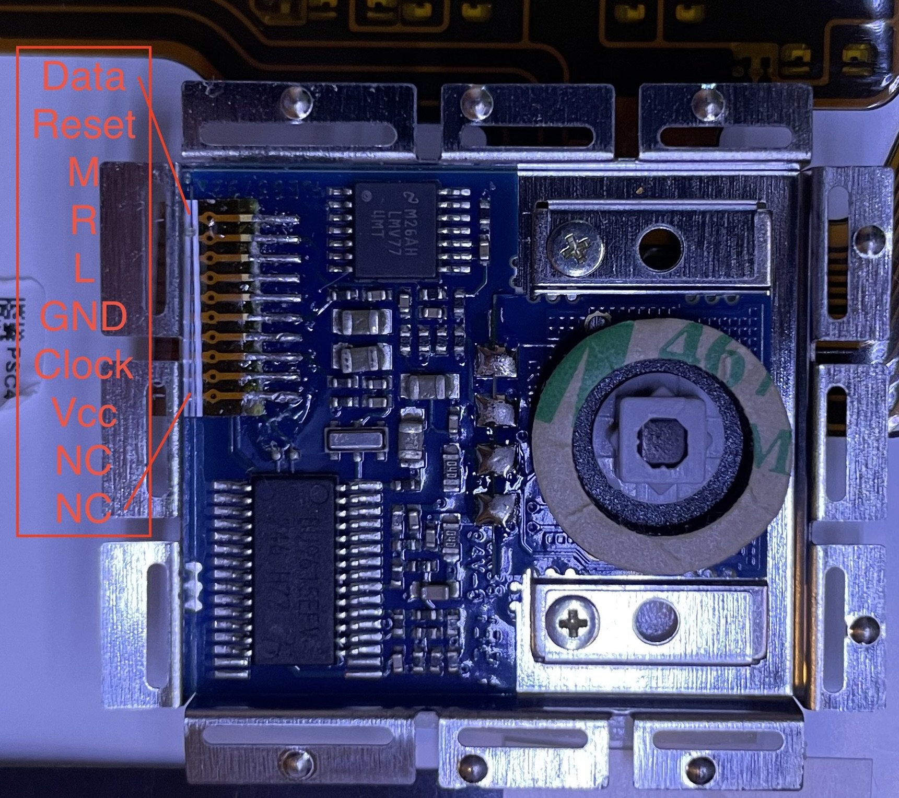
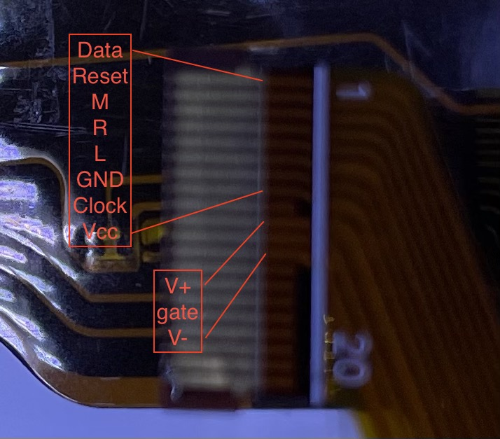
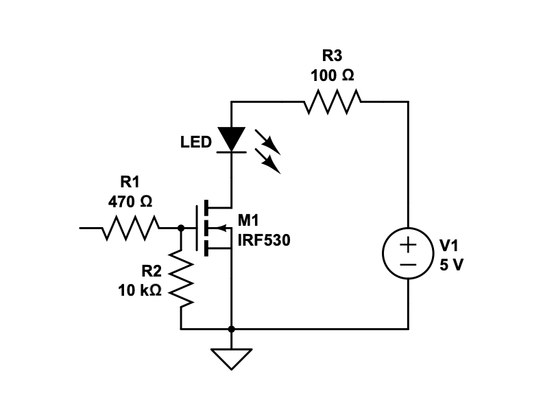
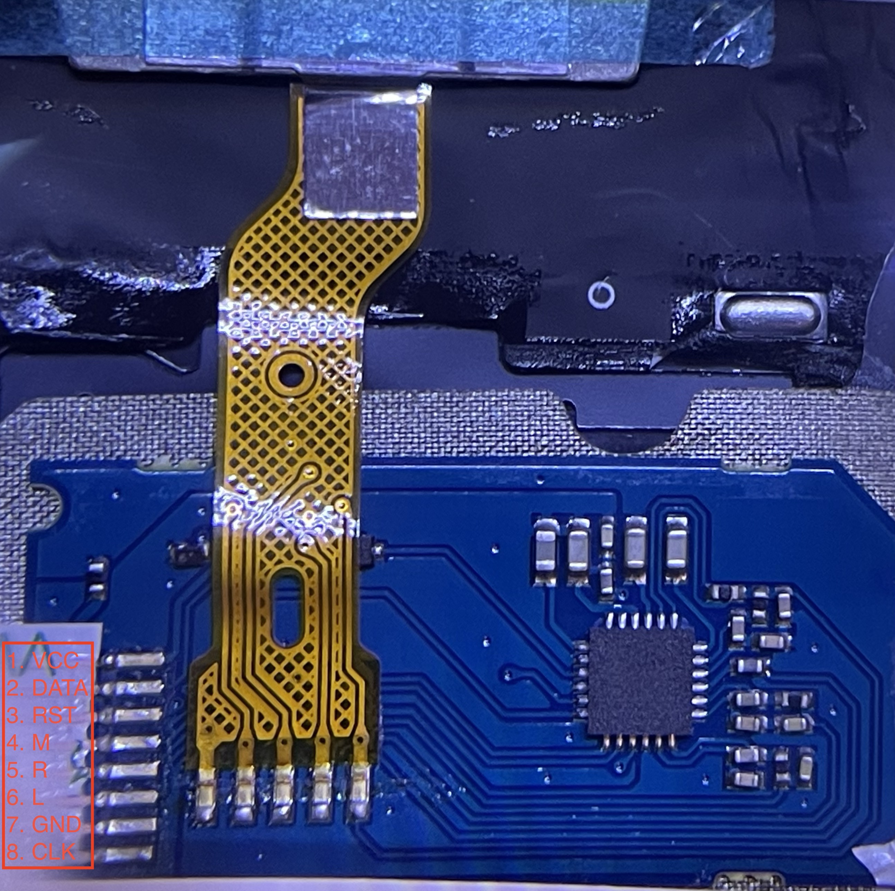

# ThinkPad keyboard and trackpoint reuse project

## Goal
Make standalone USB keyboards with trackpoints out of ThinkPad keyboards. The results are similar to an [SK-8845](https://www.lenovo.com/us/en/p/accessories-and-software/keyboards-and-mice/keyboards/0b47190).

## Reverse Engineering
The following documents how I reverse engineered the pinout of the trackpoints and the matrices of the keyboards. If anyone reading this is only interested in the end result take a look at the pictures and skip the text.

A typical ThinkPad trackpoint is a PS/2 device (so are most touchpads). It has 8 pins: Vcc, ground, data, clock, reset, and 3 for external buttons. The buttons are usually external to the trackpoint unit and integrated with the keys instead. When the buttons are pressed, the pins are connected to ground.

### Keyboard Info
* Part number: 04Y0819
* Compatible with X1 Carbon Gen 1 (unconfirmed)
* Components: 6-row keyboard, trackpoint, 3 buttons, backlight.
* Interface: 0.5-mm pitch 20-pin FPC for the trackpoint and backlight; 0.5-mm pitch 32-pin FPC for the keys and buttons.

#### Trackpoint
Many ThinkPad trackpoints use TPM754 chip. The IC on this one is unmarked but it has the same number of pins and layout. So I suspect it's also a TPM754, or at least it's pin compatible.

This trackpoint's controller PCB is connected with the trackpoint with 4 solder points. One of them must be ground, another Vcc, and two for data for x and y axis. Ground is almost certainly shared with the controller, Vcc is probably not, since it could be regulated.

To determine the pinout, I first tried to find ground. First, I spotted a crystal oscillator. I know the middle pins are ground. A simple continuity test tells me which of the 4 big solder joints is ground. So now I have a big solder joint to use the probe. The FPC has 2 traces thicker than others. So they're most likely ground and Vcc. A continuity test tells me which is ground. The other is probably Vcc. To verify, I did a continuity test with the big capacitors. I also worked under the assumption that the IC is TPM754, and used its pinout to double check the Vcc and ground pins. They both checked out!

According to the reference shcematic in the datasheet of TPM754, here are the pins that are of interest to us:

* 24: Clock
* 2: Data
* 25: Left
* 26: Right
* 27: Middle
* 5: Reset

There's no reason why IBM (and later Lenovo) would deviate from this implementation, since the datasheet was provided by Philips and the chip runs IBM's code. Sure enough, all of these pins are connected to pins on the inerface. I don't even need to do any guess work!



After connecting it to an Arduino UNO, wiring up the reset circuit (more on this later), and loading my test sketch, it worked perfectly.

There are many PS/2 libraries out there. I have written one myself for another project. I also wrote a [test sketch](https://github.com/delingren/ps2_mouse_test) specifically for testing the basic functionality of a PS/2 mouse. Upon booting, it resets the PS/2 mouse and enables it by issuing a series of PS/2 commands. If the data and clock pins are not correctly connected, it'd wait indefinitely for the device to respond. If all pins are correctly connected and the PS/2 device is functional, the sketch listens to the packets sent by the device, parse them, and prints the content on the serial console. The content includes coordianate diff in x and y directions and button states.

#### Backlight
This keyboard has a backlight. The backlight and the trackpoint share an FPC. The backlight is controlled by a MOSFET. The pins are conveiently labeled `G`, `S`, and `+D`, gate, source, and drain respectively. Since it's `+D`, I assume it's an N-channel MOSFET, which is much more common anyway. In a typical usage, source is connected to the ground, drain is connected to the load, and gate is controlled by a logical output, an MCU pin in our case.

The trackpoint and the backlight share an FPC. We have already determined the pins for the trackpoint. The backlight is quite straight-forward. The pins of the MOSFET are all exposed. So I just need to do a continuity test. Both gate and source should be each connected to a pin. The remaining one is therefore V+.



So I wired it up for a test:



And it worked perfectly. With an 100 Ω current limiting resistor, I measured ~18 mA flowing into the backlight, which consists of 18 LEDs. That's a lot of LEDs for a very small current. I suspect the resistance of the MOSFET should be enough to limit the current. Even if the resistance is only, say, 5 Ω, the voltage drop is 1.8 V, the current is 360 mA, or 20 mA each LED, low enough. So I removed the resistor and measured ~102 mA, or 5.6 mA each. That should be low enough not to burn out the LEDs. Most hosts should be able to provide 500 mA for USB 2.0 devices. That's also the default power consumption in the USB descriptor defined by QMK. There is no way we will exceed that limit.

#### Keyboard Matrix

```
    | W21   | W24   | W32   | W27   | W25   | W28   | W30   | W31   | W04   |
----+-------+-------+-------+-------+-------+-------+-------+-------+-------|
W26 | ESC   |  ~    | Tab   | 1     | Q     | A     | Z     |       |       | row 0
W20 |       | F1    | Caps  | 2     | W     | S     | X     |       |       | row 1
W22 | F4    | F2    | F3    | 3     | E     | D     | C     |       |       | row 2
W10 | F5    | F9    | BS    | F10   |       | \     | Enter | Space |       | row 3
W16 | F6    | =     | ]     | 8     | I     | K     | ,     |       |       | row 4
W18 |       | F8    | F7    | 9     | O     | L     | .     |       |       | row 5
W11 |       | Home  |       | F11   |       |       |       | Down  |       | row 6
W13 |       |       | GUI   | F12   |       |       |       | Right |       | row 7
W12 | Up    |       |       | End   |       |       |       | Left  |       | row 8
W09 |       | Del   |       | Ins   |       | PrtSc | PgUp  | PgDn  |       | row 9
W19 | G     | 5     | T     | 4     | R     | F     | V     | B     |       | row 10
W23 | H     | 6     | Y     | 7     | U     | J     | M     | N     |       | row 11
W17 | '     | -     | [     | 0     | P     | ;     |       | /     |       | row 12
W29 |       |       | LShft |       |       |       | RShft |       |       | row 13
W15 |       | LCtrl |       |       |       |       | RCtrl |       |       | row 14
W14 | LAlt  |       |       |       |       |       |       | RAlt  |       | row 15
W03 |       |       |       |       |       |       |       |       | Fn    | row 16
----+-------+-------+-------+-------+-------+-------+-------+-------+-------|
      col 0   col 1   col 2   col 3   col 4   col 5   col 6   col 7   col 8
```

Mouse buttons:
```
   | W5 | W6 | W7 |
---+----+----+----|
W8 | R  | M  | L  |
---+----+----+----|
```

Pins 1 and 2 are either not connected or used for identifying keyboard layout (ANSI, ISO, JIS). Mouse button wires will be connected to the trackpoint. 


#### MCU selection
The reverse engineering is now done. The next step is to find an suitable MCU. Let's do a tally on the GPIO pins:
* The key matrix uses 26 pins. 
* The trackpoint uses 2 pins. 
* The backlight uses another one. 
* One more for caps lock indicator. 

So the total is 30. I was originally considering a Pi Pico. RP2040 has exactly 30 GPIO pins. But Pi Pico only exposes 26. I have a few options.

* Try to reduce the number of pins. The `Fn` key is its own row and column, which is not necessary. As long as it has its own row *or* column, ghosting is not going to happen. So, I *could* cut the pin count down by 1. Even if I let go the backlight and caps lock indicator, I'm still short by one.
* Try to expose more pins on the Pi Pico. An obvious candidate is the LED (GPIO25). [This post](https://www.hackster.io/news/this-raspberry-pi-pico-hack-unlocks-two-extra-hidden-gpio-pins-and-potentially-a-couple-more-aee23753281b.amp) mentioned another 3. But it looks a bit finicky to do the surgery.
* I found this board called [Olimex RP2040-PICO30](https://www.olimex.com/Products/MicroPython/RP2040-PICO30/open-source-hardware) that exposes all 30 GPIO pins of the RP2040. But I can't seem to source it from North America. And shipping from EU is ridiculous.
* Use an I2C I/O expander. QMK has I2C support and provides hooks to support custom matrix scanning. But the code lives in the board's own space. It needs to be updated if the APIs change. I am a big fan of simplicity. So I'll try to avoid this option if possible. But if I do choose this option and use a 16 channel expander, I can use pretty much any MCU, since it effectively adds 14 pins.
* Try use a different MCU. Some research led me to WeAct STM32 F405 or F411. F411 has 32 pins. But the BOOT button uses one, and the USB connector uses 2. So I'm still short by one. So F405 is by far the best option. Some [additional config](https://github.com/drashna/qmk_firmware/blob/custom_drashna/keyboards/handwired/tractyl_manuform/5x6_right/f405/mcuconf.h#L21-L33) is needed.

<!-- ### Keyboard 2
* Part number: 01YP160
* Compatible with X390, X395, X280 (unconfirmed)
* Components: 6-row keyboard, trackpoint, 3 buttons.
* Interface: 1-mm pitch 12-pin FPC for the trackpoint; 0.5-mm pitch 36-pin FPC for the keys and buttons.

This trackpoint doesn't use a TPM745 chip. So the prior knowledge doesn't apply here. We need to start from scatch. Again, ground is usually the easiest to find out. So here we go. A quick continuity test revealted that pin 7 is connected to the chasis and thus must be ground. Then I looked at the traces. Pin 1 has the thickest trace other than ground. So it's a good candidate for Vcc. From there, I turned into the big capacitors. A couple of them are connnected to ground on one end. And the other end of one is connected to pin 1. And pin 1 is also connected to a resistor (blocked by the golden FPC in the picture). So I'm pretty confident pin 1 is Vcc.

With Vcc and ground correctly determined, there's little chance you'd fry the controller. So I hooked it up to an Arduino Uno using a FPC connector breakout board. A few trial and errors later, the data and clock pins were identified. Then I shorted the rest pins to ground one by one and observe the output to determine which pins are for the 3 buttons. After that, the remaining single pin must be reset.

 -->

## Firmware
I've always used QMK for keyboard projects. It's the most popular firmware in the mechanical keyboard community. It also has support for PS/2 pointing devices. So that's what I'm using. Another option is ZMK, which is the new kid on the block. I don't have experiences with it. PS/2 support in QMK is new to me, so I played with it a little bit with a few MCUs in my drawer:

* Teensy 2.0 (mini USB)
* ProMicro (micro USB and USB C)
* Pi Pico (USB C)
* RP2040 Zero (USB C)

The fromer two are based on ATMega32U4. The latter two are based on RP2040. On ATMega32U4, there are three options for PS/2: busy wait (only works in remote mode, not stream mode), interrupt, and usart. Busy wait is not really an option. It's a polling method. The other two are both fine. But usart needs to use D5 pin, which is not available on ProMicro, unless you remove an onboard LED.

So I did some prototyping on both chips following the instructions from [QMK docs](https://docs.qmk.fm/features/ps2_mouse). The prototype is a keyboard definition that has just one key and a PS/2 pointing device.

With Teensy, I set clock pin to D5 and data pin to D2 and it worked with both usart and interrupt drivers. With ProMicro, I set clock pin to D2 and data pin to D3 and it worked with the interrupt driver. Initially, I couldn't get ProMicro to work. But it did after tearing apart the breakboard and reconnecting everything. It was probably a bad connection.

For RP2040, QMK uses RP2040's PIO to drive PS/2. All these combinations worked as expected. This gives me plenty of options to work with.

Here's the `keyboard.json` definition.

```
{
    "keyboard_name": "Mouse",
    "manufacturer": "DIY",
    "maintainer": "delingren",
    
    // Teensy
    // "processor": "atmega32u4",
    // "bootloader": "halfkay",
    
    // ProMicro
    // "processor": "atmega32u4",
    // "bootloader": "caterina",

    // Pi Pico and RP2040 Zero
    "bootloader": "rp2040",
    "processor": "RP2040",

    "diode_direction": "COL2ROW",
    "matrix_pins": {
        // ATMega32U4
        // "rows": ["B1"],
        // "cols": ["B2"]

        // RP2040
        "rows": ["GP1"],
        "cols": ["GP2"]
    },
    "ps2": {
        "enabled": true,
        "mouse_enabled": true,

        // Teensy and ProMicro
        // "clock_pin": "D2",
        // "data_pin": "D3",
        // "driver": "interrupt"

        // Pi Pico and RP2040 Zero
        "clock_pin": "GP1",
        "data_pin": "GP0",
        "driver": "vendor"
    },
    "usb": {
        "vid": "0xFFFF",
        "pid": "0x0003",
        "device_version": "1.0.0"
    },
    "features": {
        "extrakey": true,
        "mousekey": true,
        "bootmagic": true
    },
    "layouts": {
        "LAYOUT_mono": {
            "layout": [
                {"label":"Mute", "matrix": [0, 0], "x":0, "y":0}
            ]
        }
    }
}
```

And here's `config.h`:
```
#pragma once

// clang-format off
#ifdef PS2_DRIVER_INTERRUPT
#define PS2_INT_INIT()  do {    \
    EICRA |= ((1<<ISC21) |      \
              (0<<ISC20));      \
} while (0)
#define PS2_INT_ON()  do {      \
    EIMSK |= (1<<INT2);         \
} while (0)
#define PS2_INT_OFF() do {      \
    EIMSK &= ~(1<<INT2);        \
} while (0)
#define PS2_INT_VECT   INT2_vect
#endif

#ifdef PS2_DRIVER_USART
/* synchronous, odd parity, 1-bit stop, 8-bit data, sample at falling edge */
/* set DDR of CLOCK as input to be slave */
#define PS2_USART_INIT() do {   \
    PS2_CLOCK_DDR &= ~(1<<PS2_CLOCK_BIT);   \
    PS2_DATA_DDR &= ~(1<<PS2_DATA_BIT);     \
    UCSR1C = ((1 << UMSEL10) |  \
              (3 << UPM10)   |  \
              (0 << USBS1)   |  \
              (3 << UCSZ10)  |  \
              (0 << UCPOL1));   \
    UCSR1A = 0;                 \
    UBRR1H = 0;                 \
    UBRR1L = 0;                 \
} while (0)
#define PS2_USART_RX_INT_ON() do {  \
    UCSR1B = ((1 << RXCIE1) |       \
              (1 << RXEN1));        \
} while (0)
#define PS2_USART_RX_POLL_ON() do { \
    UCSR1B = (1 << RXEN1);          \
} while (0)
#define PS2_USART_OFF() do {    \
    UCSR1C = 0;                 \
    UCSR1B &= ~((1 << RXEN1) |  \
                (1 << TXEN1));  \
} while (0)
#define PS2_USART_RX_READY      (UCSR1A & (1<<RXC1))
#define PS2_USART_RX_DATA       UDR1
#define PS2_USART_ERROR         (UCSR1A & ((1<<FE1) | (1<<DOR1) | (1<<UPE1)))
#define PS2_USART_RX_VECT       USART1_RX_vect
#endif

// clang-format on
```

## Hardware Interface
The keys are straight-forward. The matrix pins are connected to GPIO pins of the MCU.

The trackpoint is not complicated either. The button pins need to be properly wired; data and clock pins are connected to GPIO pins (more in the next section); The trackpoints seem to be able to handle both 3.3 volts and 5 volts. The voltage selection should then be dictated by the MCU.

One issue worth mentioning is, the reset wire needs to be pulsed high during boot. During prototyping, I initially failed to realize this. One of the trackpoints worked but the other one failed 90% of the time. Then I realized the mistake when I was reading about Frank Adam's project. See references 2. This can be found in TPM754's datasheet, in the reference shcematic. The one that worked must be the one not using TPM754. 

For the physical connection, I bought some 0.5 mm and 1 mm FPC connector breakout boards from AliExpress. 

## References

1. [Laptop Touchpad/Trackpoint Conversion to USB](https://www.hackster.io/frank-adams/laptop-touchpad-trackpoint-conversion-to-usb-d70519#toc-i2c-6), Frank Adams. 
1. [T41 keyboard controller with Teensy](https://github.com/thedalles77/USB_Laptop_Keyboard_Controller/blob/master/Example_Keyboards/IBM_T41_Keyboard_and_Touchpad/T41_Teensy.pdf), Frank Adams.
1. [A Chinese blog on reverse engineering ThinkPad trackpoints](https://www.mydigit.cn/forum.php?mod=viewthread&tid=293118&page=1), shmilyuho.
1. https://www.mydigit.cn/forum.php?mod=viewthread&tid=138236&page=1
1. [QMK PS2 mouse doc](https://docs.qmk.fm/features/ps2_mouse).
1. [TrackPoint pinout wiki page on deskthority](https://deskthority.net/wiki/TrackPoint_Hardware).
1. [Another repository of pinouts](https://github.com/alonswartz/trackpoint/tree/master/pinouts), Alon Swartz.