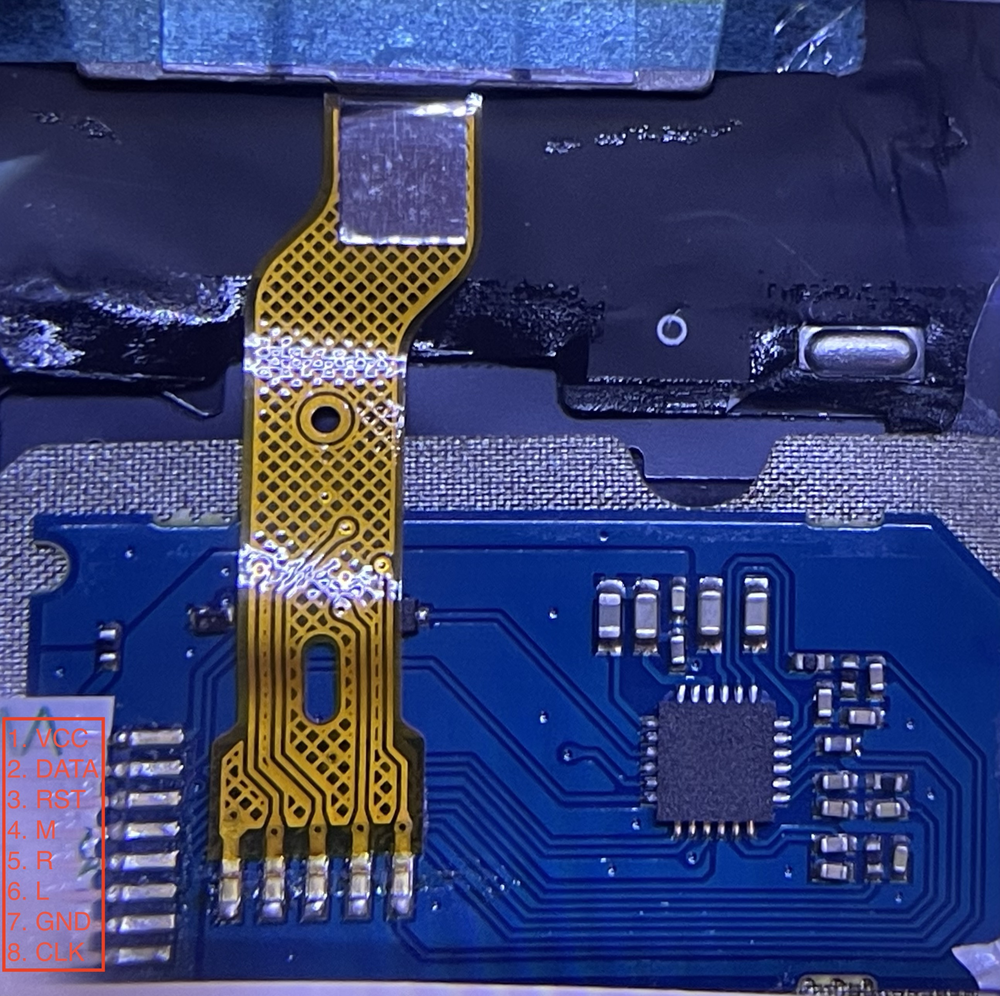

### Keyboard Info

* Part number: 01YP160
* Compatible with X390, X395, X280 (unconfirmed)
* Components: 6-row keyboard, trackpoint, 3 buttons.
* Interface: 1-mm pitch 12-pin FPC for the trackpoint; 0.5-mm pitch 36-pin FPC for the keys and buttons.

#### Trackpoint

This trackpoint doesn't use a TPM745 chip. So the prior knowledge doesn't apply here. We need to start from scatch. Again, ground is usually the easiest to find out. So here we go. A quick continuity test revealted that pin 7 is connected to the chasis and thus must be ground. Then I looked at the traces. Pin 1 has the thickest trace other than ground. So it's a good candidate for Vcc. From there, I turned into the big capacitors. A couple of them are connnected to ground on one end. And the other end of one is connected to pin 1. And pin 1 is also connected to a resistor (blocked by the golden FPC in the picture). So I'm pretty confident pin 1 is Vcc.

With Vcc and ground correctly determined, there's little chance you'd fry the controller. So I hooked it up to an Arduino Uno using a FPC connector breakout board. A few trial and errors later, the data and clock pins were identified. Then I shorted the rest pins to ground one by one and observe the output to determine which pins are for the 3 buttons. After that, the remaining single pin must be reset.



#### Keyboard Matrix

Determining the keyboard matrix is done the same way as the [other keyboard](README.md).

```
    | W25   | W28   | W36   | W31   | W29   | W32   | W34   | W35   | W08   |
----+-------+-------+-------+-------+-------+-------+-------+-------+-------|
W30 | ESC   | ~     | Tab   | 1     | Q     | A     | Z     |       |       | row 0
W24 |       | F1    | Caps  | 2     | W     | S     | X     |       |       | row 1
W26 | F4    | F2    | F3    | 3     | E     | D     | C     |       |       | row 2
W14 | F5    | F9    | BS    | F10   |       | \     | Enter | Space |       | row 3
W20 | F6    | =     | ]     | 8     | I     | K     | ,     |       |       | row 4
W22 |       | F8    | F7    | 9     | O     | L     | .     |       |       | row 5
W15 |       | Del   |       | F11   |       |       |       | Down  |       | row 6
W17 |       |       | GUI   | F12   |       |       |       | Right |       | row 7
W16 | Up    | Home  |       | End   |       |       |       | Left  |       | row 8
W13 |       | PgUp  |       | PgDn  |       |       |       |       |       | row 9
W23 | G     | 5     | T     | 4     | R     | F     | V     | B     |       | row 10
W27 | H     | 6     | Y     | 7     | U     | J     | M     | N     |       | row 12
W21 | '     | -     | [     | 0     | P     | ;     |       | /     |       | row 13
W33 |       |       | LShft |       |       |       | RShft |       |       | row 13
W19 |       | LCtrl |       |       |       |       | RCtrl |       |       | row 14
W18 | LAlt  |       |       | PrtSc |       |       |       | RAlt  |       | row 15
W07 |       |       |       |       |       |       |       |       | Fn    | row 16
----+-------+-------+-------+-------+-------+-------+-------+-------+-------+
      col 0   col 1   col 2   col 3   col 4   col 5   col 6   col 7   col 8
```

Interestingly, this matrix is very similar to the other one, including the wire order, but with a couple of minor differences, namely, `Home`, `Ins`, `Ins`, `PrtSc`, `PgUp` and `PgDn`. 

```
   | W4 | W2 | W3 |
---+----+----+----|
W5 | L  | M  | R  |
---+----+----+----+
```

#### LED indicators

This keyboard has 4 LED indicators. After determining the keyboard matrix, it's just a matter of trial and error to figure out the pinout for the indicators. I just hooked up a 3.3 V power supply with a 100 Ohm resistor and tried all the combinations. Unlike the backlight, these LEDs require very little current and are not controlled by a MOSFET.

```
W12: Common anode
W06: caps lock
W09: mic mute
W10: speaker mute
W11: Fn lock
```

Caps lock indicator is a standard HID keyboard indicator, and it is supported by QMK. We can turn on Fn LED when the Fn layer is active. This can be easily done in QMK. I don't know what to do with the mic and speaker mute LEDs yet. They are not part of HID keyboard spec. Maybe I can use them as layer indicators.

The total pin count is 32 for this keyboard.